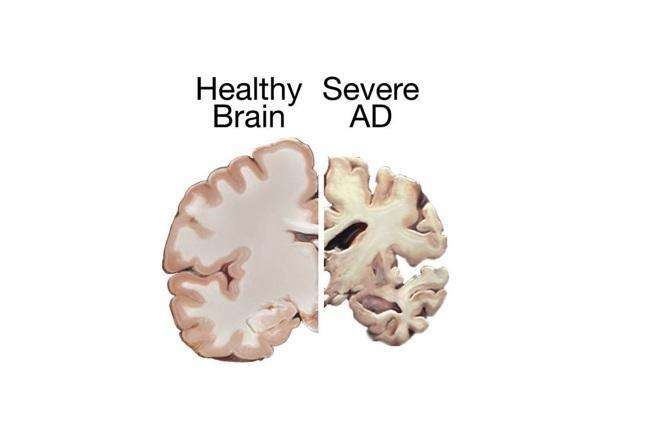
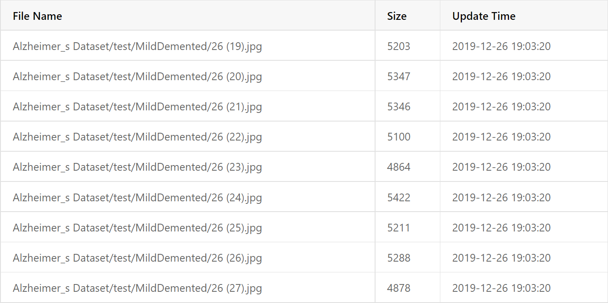
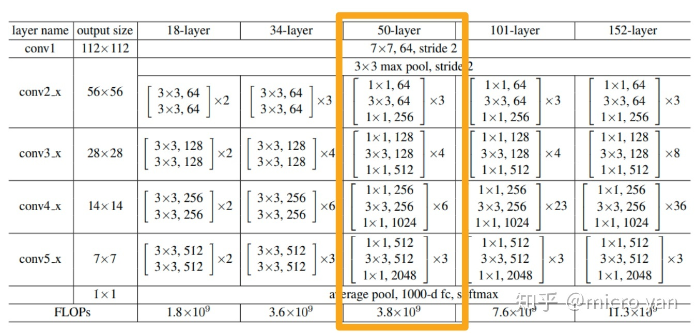
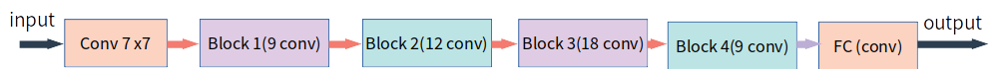

# CTAD
This project is mainly based on resnet50 to recognize the brain CT images of patients with Alzheimer's disease, in order to assist doctors to make more accurate judgment on the patient's condition.

# 【AI达人创造营第二期】老年痴呆患者的福音！阿尔兹海默症病情预测系统


## 一.项目背景介绍

阿尔兹海默症给许多家庭带来了巨大的伤害。同时患者本人也会产生·如下特征：

* 记忆衰退到影响日常生活
* 无法胜任原本熟悉的事务
* 表达能力出现问题
* 对时间、地点的概念下降
* 判断力变差、警觉性降低
* 抽象思考出现困难
* 东西摆放错乱
* 行为与情绪出现改变
* 个性改变
* 不想做事

当普通人意识到家中老人可能进入“痴呆阶段”，其实可能已经错过了早期最佳的治疗时机。所以为了辅助解决这一问题，我们利用计算机技术以辅助医生对患者病情进行更好的判断。


大脑皮层是高级神经功能的结构基础。与正常衰老相似，阿尔兹海默症与大脑结构进行性破坏和功能去分化有关。正常人的左右大脑皮层厚度是不对称的，这有利于左右大脑半球有效构建神经功能网络，也可能是认知等高级功能执行的基础。但是阿尔兹海默症患者，皮层逐渐变薄，但两侧变薄的速度并不相同，因此两侧半球的不对称性也在改变。并且患者病情越严重，皮层越薄，两侧越不对称。通过图像处理的方法对MRI图像进行分析，可以实现对阿尔兹海默症患者病情的初步判断，从而辅助医生对患者病情的判断。计算能力的提高、存储设备的发展，使得传统视觉技术中存在的问题逐渐得到改善或解决。我们可以将模型部署在相关的硬件上来实现落地应用。




## 二.数据介绍

数据集由MRI图像组成，数据具有训练和测试集的四类图像。具体详见[阿尔兹海默症数据集](https://aistudio.baidu.com/aistudio/datasetdetail/116093)




```python
#查看当前挂载的数据集目录, 该目录下的变更重启环境后会自动还原
!ls /home/aistudio/data
```

```python
#把数据集解压到work文件夹CTAD文件夹下。
!unzip -oq data/data116093/阿尔茨海默氏病.zip -d work/CTAD
```


```python
#查看数据集目录结构
!tree work/CTAD/ -d
```

```python
#样本可视化展示
import cv2
import matplotlib.pyplot as plt
%matplotlib inline

plt.title("ModerateDemented/moderateDem0")
img = plt.imshow(cv2.imread("work/CTAD/Alzheimer_s Dataset/train/ModerateDemented/moderateDem0.jpg"))
plt.axis('off') 
    
```


### 2.1.图像数据的统计与分析


```python
# 计算图像数据整体均值和方差
import glob
import numpy as np

data_path='/home/aistudio/work/CTAD/Alzheimer_s Dataset/*/*/*.jpg'

def get_mean_std(image_path_list):
    print('Total images:', len(image_path_list))
    max_val, min_val = np.zeros(3), np.ones(3) * 255
    mean, std = np.zeros(3), np.zeros(3)
    for image_path in image_path_list:
        image = cv2.imread(image_path)
        for c in range(3):
            mean[c] += image[:, :, c].mean()
            std[c] += image[:, :, c].std()
            max_val[c] = max(max_val[c], image[:, :, c].max())
            min_val[c] = min(min_val[c], image[:, :, c].min())

    mean /= len(image_path_list)
    std /= len(image_path_list)

    mean /= max_val - min_val
    std /= max_val - min_val

    return mean, std


mean, std = get_mean_std(glob.glob(data_path))
print('mean:', mean)
print('std:', std)
```


### 2.2.数据集类的定义

数据准备过程包括以下两个重点步骤：

一是建立样本数据读取路径与样本标签之间的关系。

二是构造读取器与数据预处理。可以写个自定义数据读取器，它继承于PaddlePaddle2.0的dataset类，在__getitem__方法中把自定义的预处理方法加载进去。


```python
import random
import os

label_list=[['MildDemented',0],['ModerateDemented',1],['NonDemented',2],['VeryMildDemented',3]]
label_dic = dict(label_list)
#print(label_dic)
train_list = []
test_list = []

train_path = '/home/aistudio/work/CTAD/Alzheimer_s Dataset/train/'
for i in os.listdir(train_path):
    if i not in '.DS_Store':
        for j in os.listdir(os.path.join(train_path, i)):
            train_list.append(f'{os.path.join(train_path, i, j)}\t{label_dic[i]}\n')

test_path = '/home/aistudio/work/CTAD/Alzheimer_s Dataset/test/'
for i in os.listdir(test_path):
    if i not in '.DS_Store':
        for j in os.listdir(os.path.join(test_path, i)):
            test_list.append(f'{os.path.join(test_path, i, j)}\t{label_dic[i]}\n')

random.shuffle(train_list)  # 乱序
random.shuffle(test_list)
print(train_list[0])
train_len = len(train_list)
tets_len = len(test_list)

if(os.path.exists('./train_set.txt')):  # 判断有误文件
    os.remove('./train_set.txt')  # 删除文件
if(os.path.exists('./validation_set.txt')):
    os.remove('./validation_set.txt')

for data in train_list:
        with open('./train_set.txt', 'a')as f:
            f.write(data)

for data in test_list:
        with open('./validation_set.txt', 'a')as f:
            f.write(data)
```


```python
import paddle
from paddle.vision.transforms import Compose,CenterCrop, Resize,Normalize,RandomRotation,RandomHorizontalFlip,Transpose,ToTensor
import cv2
import numpy as np
from PIL import Image
from paddle.io import Dataset

# 自定义数据读取器
class Reader(Dataset):
    def __init__(self, mode='train_set'):
        """
        初始化函数
        """
        self.data = []
        with open(f'{mode}_set.txt') as f:
            for line in f.readlines():
                info = line.strip().split('\t')
                if len(info) > 0:
                    self.data.append([info[0].strip(), info[1].strip()])  
            #print(self.data)          
    def __getitem__(self, index):
        """
        读取图片，对图片进行归一化处理，返回图片和标签
        """
        image_file, label = self.data[index]  # 获取数据
        img = Image.open(image_file)  # 读取图片
        img = img.convert('RGB')
        img = img.resize((224 , 224), Image.ANTIALIAS)  # 图片大小样式归一化
        img = np.array(img).astype('float32')  # 转换成数组类型浮点型32位
        img = img.transpose((2, 0, 1))     #读出来的图像是rgb,rgb,rbg..., 转置为 rrr...,ggg...,bbb...
        img = img/255.0  # 数据缩放到0-1的范围
        return img, np.array(label, dtype='int64')

    def __len__(self):
        """
        获取样本总数
        """
        return len(self.data)
```

### 2.3.数据集类的测试


```python
# 训练的数据提供器
train_dataset = Reader(mode='train')
# 测试的数据提供器
eval_dataset = Reader(mode='validation')

# 查看训练和测试数据的大小
print('train大小：', train_dataset.__len__())
print('test大小：', eval_dataset.__len__())

# 查看图片数据、大小及标签
for data, label in eval_dataset:
    print(data)
    print(np.array(data).shape)
    print(label)
    break
```


## 三.模型介绍

### 3.1.简述

Resnet是残差网络(Residual Network)的缩写,该系列网络广泛用于目标分类等领域以及作为计算机视觉任务主干经典神经网络的一部分，典型的网络有resnet50, resnet101等。Resnet网络的证明网络能够向更深（包含更多隐藏层）的方向发展。

### 3.2.Resnet50网络结构

首先对输入做了卷积操作，之后包含4个残差快（ResidualBlock), 最后进行全连接操作以便于进行分类任务，网络构成示意图如下所示, Resnet50则包含50个conv2d操作。






```python
from paddle.vision.models import resnet50import paddle.nn.functional as Fclass MyCNN(paddle.nn.Layer):    def __init__(self):        super(MyCNN,self).__init__()        #####   #######        self.layer=paddle.vision.models.resnet50(pretrained=True)        self.dropout=paddle.nn.Dropout(p=0.5)        self.fc1 = paddle.nn.Linear(1000, 512)        self.fc2 = paddle.nn.Linear(512, 20)        #####   #######    def forward(self,x):        #####   #######        x=self.layer(x)        x=self.dropout(x)        x=self.fc1(x)        x=F.relu(x)        x=self.fc2(x)        return x        #####   #######
```


```python
input_define = paddle.static.InputSpec(shape=[-1,3,224,224], dtype="float32", name="img")label_define = paddle.static.InputSpec(shape=[-1,1], dtype="int64", name="label")model = MyCNN() # 模型封装model = paddle.Model(model,inputs=input_define,labels=label_define)model.summary((1,3, 224, 224))
```


## 四.模型训练

我们将学习率设置为0.000005，进行50轮训练。后期还可以进一步调优，该效果并不是最好的效果，理论上学习率越小越好。


```python
# 配置优化器、损失函数、评估指标model.prepare(paddle.optimizer.Adam(learning_rate=0.000005, parameters=model.parameters()),               paddle.nn.CrossEntropyLoss(),               paddle.metric.Accuracy())# 训练可视化VisualDL工具的回调函数visualdl = paddle.callbacks.VisualDL(log_dir='visualdl_log')   # 启动模型全流程训练model.fit(train_dataset,  # 训练数据集          eval_dataset,   # 评估数据集          epochs=50,       # 训练的总轮次          batch_size=64,  # 训练使用的批大小          verbose=1,      # 日志展示形式          callbacks=[visualdl])  # 设置可视化
```

```python
result = model.evaluate(eval_dataset, verbose=1)print(result)model.save('./Ctad')  # 保存模型
```


## 五.模型评估

该部分主要是对训练好的模型进行评估，我们从所有数据中随机选择一张阿尔海默症患者的脑部CT图像并对其患病程度进行预测，并将预测结果可视化。


```python
def load_image(file):        # 打开图片        im = Image.open(file)        # 将图片调整为跟训练数据一样的大小        im = im.convert('RGB')        im = im.resize((224, 224), Image.ANTIALIAS)        # 建立图片矩阵 类型为float32        im = np.array(im).astype(np.float32)        # 矩阵转置         im = im.transpose((2, 0, 1))                                       # 将像素值从[0-255]转换为[0-1]        im = im / 255.0        # print(im)               im = np.expand_dims(im, axis=0)        # 保持和之前输入image维度一致        print('im_shape的维度：',im.shape)        return im
```


```python
from PIL import Image# site = 255  # 读取图片位置model_state_dict = paddle.load('./Ctad.pdparams')  # 读取模型model = MyCNN()  # 实例化模型model.set_state_dict(model_state_dict) model.eval()data_path='/home/aistudio/work/CTAD/Alzheimer_s Dataset/*/*/*.jpg'but_files =glob.glob(data_path)index=random.choice(but_files)  # 随机获取一个地址img = load_image(index)print(paddle.to_tensor(img).shape)# print(paddle.reshape(paddle.to_tensor(img), (1, 3, 224, 224)))ceshi = model(paddle.reshape(paddle.to_tensor(img), (1, 3, 224, 224)))  # 测试print('预测的结果为:', list(label_dic.keys())[np.argmax(ceshi.numpy())])  # 获取值Image.open(index)  # 显示图片
```


## 六.总结与展望

经过实验和分析，设计基本达到了设计目标，实现了在对阿尔兹海默症图像分类的效果，猫咪分类准确率最高为63%，并且提升空间巨大，说明基于飞桨框架的图像分类具有较好的准确率。

直接fork的版本可以达到0.63的准确度,但是只要好好学习，调整部分参数,结果将会极为喜人,小伙伴们加油啊!

通过学习这个项目,小伙伴们可以更进一步的掌握ResNet的网络的基础结构。

对数据集进行扩充和对数据集的优化是本项目未来的方向。


## 七.个人简介

河南理工大学，计算机科学与技术学院计算机科学与技术专业，本科三年级在读

本人主要研究方向是推荐系统和计算机视觉，欢迎大家fork、评论、喜欢三连

aistudio链接：https://aistudio.baidu.com/aistudio/usercenter

github链接：https://github.com/jiejieyun/CTAD

gitee链接：https://gitee.com/MingjieLove/CTAD
